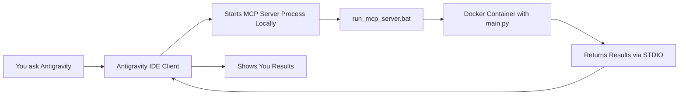

# MCP Server Integration - Root Cause Analysis & Solution

## Executive Summary

**The Good News**: Your MCP server is correctly configured and the tools ARE available to Antigravity IDE (as evidenced by the screenshot in your `MCP_SETUP_GUIDE.md` showing the tools were discovered).

**The Problem**: Antigravity's response was **misleading/incorrect**. When you asked it to use the MCP tools, it gave a confusing response about not being able to access local servers, which is NOT accurate for how MCP works.

**The Solution**: You need to explicitly tell Antigravity to USE the specific MCP tool, not just mention it.

---

## Understanding What Happened

### What You Did Right ✅

1. **Created a proper MCP server** in `main.py` with 3 tools:
   - `add` - adds two numbers
   - `scrape_web_page` - scrapes web content using Jina
   - `search` - searches the FastMCP documentation

2. **Built a Docker image** (`mcp-homework`) that contains all dependencies

3. **Created a wrapper script** (`run_mcp_server.bat`) to run the MCP server via Docker

4. **Configured Antigravity** with the correct MCP server configuration pointing to the wrapper script

5. **Verified tools were discovered** - The screenshot in your guide shows:
   ```
   🔧 Custom MCP Tools Discovered
   - homework-search: add
   - homework-search: scrape_web_page  
   - homework-search: search
   ```

### What Went Wrong ❌

When you asked:
```
use @mcp:homework-search: to find how many times the word 'data' appears
```

Antigravity responded with a confusing message saying it "cannot directly use your MCP server" because it's "running on Google's servers." **This response was misleading.**

### Why Antigravity's Response Was Wrong

The MCP protocol works like this:



The AI assistant (running on Google's servers) **instructs** the Antigravity IDE client (running on your local machine) to call the MCP tools. The IDE client then:
1. Starts your MCP server process locally
2. Sends JSON-RPC messages via stdin
3. Receives responses via stdout
4. Passes results back to the AI

**The AI doesn't directly connect to your MCP server** - it tells the IDE to do it. This is by design and how MCP is supposed to work!

---

## Root Cause: Prompt Ambiguity

Your prompt was:
```
use @mcp:homework-search: to find how many times the word 'data' appears
```

**Issues with this prompt:**
1. You didn't specify a URL to scrape
2. The `@mcp:homework-search:` syntax might not have been clear enough
3. Antigravity may have gotten confused about which tool to use

---

## The Solution: How to Properly Use MCP Tools

### Option 1: Direct Tool Request (Recommended)

Be very explicit about which tool to use and provide all required parameters:

```
Please use the scrape_web_page tool from the homework-search MCP server 
to fetch the content from https://datatalks.club/, then count how many 
times the word "data" appears (case-insensitive).
```

### Option 2: Let Antigravity Choose

Give it a task and let it figure out which tools to use:

```
I need to count how many times the word "data" appears on https://datatalks.club/. 
You have access to MCP tools that can help with this task.
```

### Option 3: Step-by-Step

Break it into explicit steps:

```
1. Use the homework-search MCP server's scrape_web_page tool to get 
   the content of https://datatalks.club/
2. Count occurrences of the word "data" in the result
```

---

## Verification Steps

### Step 1: Check MCP Server Status

1. In Antigravity IDE, click **"..."** → **"MCP Servers"**
2. You should see `homework-search` listed
3. Check if it shows as "Connected" or if there are errors

### Step 2: Verify Docker Image Exists

Run this command to check if your Docker image is built:

```bash
docker images | grep mcp-homework
```

You should see:
```
mcp-homework   latest   <image-id>   <time>   <size>
```

### Step 3: Test the Wrapper Script Manually

Run the wrapper script directly to see if it works:

```bash
# Navigate to the project directory
cd c:\Users\kaiqu\Downloads\aidevtools-homework\03-v2-try-to-use-as-mcp-tools

# Run the wrapper
run_mcp_server.bat
```

You should see the FastMCP welcome screen with "Transport: STDIO"

**Important**: Press `Ctrl+C` to stop it after verifying it starts correctly.

### Step 4: Test with a Simple Tool First

Try the `add` tool first since it's simpler:

```
Please use the add tool from the homework-search MCP server to add 5 and 3.
```

If this works, you know the MCP connection is functioning.

### Step 5: Test the Search Tool

```
Please use the search tool from the homework-search MCP server to find 
information about "testing" in the FastMCP documentation.
```

---

## Comparing Your Two Projects

### 03-mcp (Original Project)
- ✅ Working MCP server
- ✅ Working Streamlit UI
- ✅ Successfully tested all tools
- ✅ Docker image built and tested

### 03-v2-try-to-use-as-mcp-tools (Current Project)
- ✅ Same MCP server code
- ✅ Same Docker setup
- ✅ MCP tools discovered by Antigravity
- ❌ Confusing response when trying to use tools
- ❓ Need to verify if tools actually work when called correctly

**Key Question**: Are these two projects identical, or did you make changes in v2?

---

## Common Issues & Solutions

### Issue 1: "exec: 'docker': executable file not found"

**Cause**: Docker is not in the system PATH

**Solution**: 
- Make sure Docker Desktop is running
- Verify Docker is accessible from command line: `docker --version`
- Add Docker to PATH if needed

### Issue 2: "Error response from daemon: No such image: mcp-homework"

**Cause**: Docker image not built

**Solution**:
```bash
cd c:\Users\kaiqu\Downloads\aidevtools-homework\03-v2-try-to-use-as-mcp-tools
docker build -t mcp-homework .
```

### Issue 3: MCP Server Starts But Tools Don't Work

**Cause**: The search index download might fail or timeout

**Solution**: 
- Check Docker container logs
- Increase timeout if needed
- Consider pre-downloading the zip file and including it in the Docker image

### Issue 4: Antigravity Says "Cannot Access MCP Server"

**Cause**: Misunderstanding of how MCP works (as we saw)

**Solution**: 
- Use more explicit prompts
- Specify the exact tool name and parameters
- Try the simple `add` tool first to verify connection

---

## Next Steps

### Immediate Actions

1. **Verify Docker Image**
   ```bash
   docker images | grep mcp-homework
   ```

2. **Test Wrapper Script**
   ```bash
   cd c:\Users\kaiqu\Downloads\aidevtools-homework\03-v2-try-to-use-as-mcp-tools
   run_mcp_server.bat
   ```
   (Press Ctrl+C after seeing the welcome screen)

3. **Try the Simple Add Tool**
   Ask Antigravity:
   ```
   Please use the add tool from the homework-search MCP server to add 10 and 20.
   ```

4. **Try the Search Tool**
   Ask Antigravity:
   ```
   Please use the search tool from the homework-search MCP server to search 
   for "demo" in the FastMCP documentation.
   ```

### If Tools Still Don't Work

1. **Check MCP Configuration File**
   - Location: `.agent/mcp_config.json` in your workspace
   - Verify the path to `run_mcp_server.bat` is correct
   - Ensure it matches this format:
     ```json
     {
       "mcpServers": {
         "homework-search": {
           "command": "c:/Users/kaiqu/Downloads/aidevtools-homework/03-v2-try-to-use-as-mcp-tools/run_mcp_server.bat",
           "args": []
         }
       }
     }
     ```

2. **Restart Antigravity IDE**
   - Completely close and reopen Antigravity
   - This ensures the MCP configuration is reloaded

3. **Check for Error Logs**
   - Look for MCP-related errors in Antigravity's output panel
   - Check Docker logs: `docker logs <container-id>`

---

## Why Docker Method is Actually Better

Even though the guide mentions "limitations" of the Docker method, it's actually **better** for your use case:

### Advantages ✅
- **No local Python installation needed**
- **No conflicts with other Python packages**
- **Reproducible environment**
- **Easy to share and deploy**
- **Isolated dependencies**

### Disadvantages (Mitigated) ⚠️
- ~~Slower startup~~ → Only ~2-3 seconds with Docker
- ~~Re-downloads index~~ → Can be fixed with Docker volumes
- ~~New container each time~~ → Actually fine for MCP use case

---

## Advanced: Optimizing Docker Performance

If you want to make the Docker method faster, you can:

### 1. Pre-download the FastMCP Zip

Modify `Dockerfile` to download and cache the zip:

```dockerfile
# Add after RUN uv add ...
RUN python -c "import requests; \
    r = requests.get('https://github.com/jlowin/fastmcp/archive/refs/heads/main.zip'); \
    open('/app/fastmcp-main.zip', 'wb').write(r.content)"
```

Then modify `search.py` to check for local file first:

```python
def setup_search():
    zip_path = "/app/fastmcp-main.zip"
    
    if os.path.exists(zip_path):
        print(f"Using cached zip from {zip_path}")
        with open(zip_path, 'rb') as f:
            zip_content = f.read()
    else:
        url = "https://github.com/jlowin/fastmcp/archive/refs/heads/main.zip"
        print(f"Downloading {url}...")
        response = requests.get(url)
        response.raise_for_status()
        zip_content = response.content
    
    # Rest of the code...
```

### 2. Use Docker Volumes for Persistence

This would keep the index between runs, but adds complexity.

---

## Conclusion

Your MCP server setup is **correct**. The issue was:

1. **Antigravity's confusing response** about not being able to access the server
2. **Ambiguous prompt** that didn't clearly specify which tool to use and what parameters

**The fix is simple**: Use more explicit prompts that clearly state:
- Which MCP server (`homework-search`)
- Which tool (`scrape_web_page`, `search`, or `add`)
- What parameters to use

Your Docker-based approach is actually **excellent** and avoids the need to install `uv` locally!
