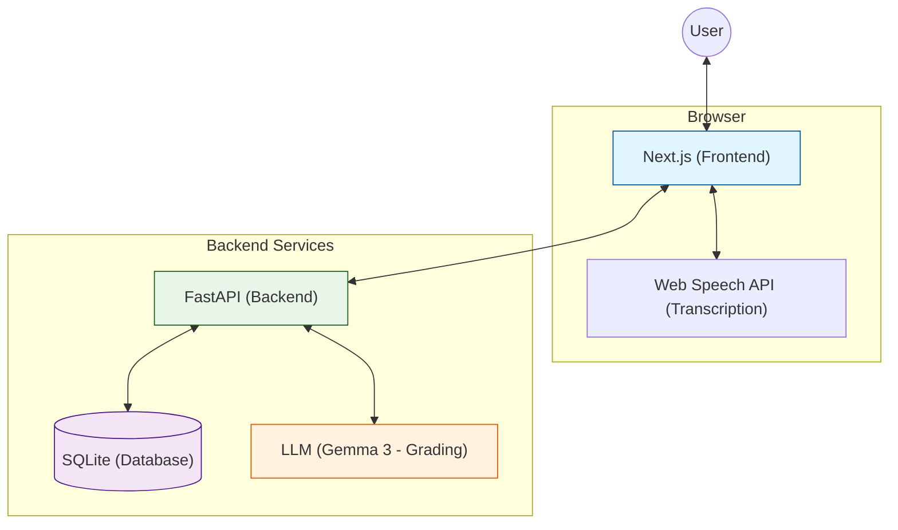

# Project Agent Instructions

## Project Overview
- **Name**: Finnish Language Learner
- **Description**: A web application that helps English users learn and practice their reading, writing, listening and speaking Finnish language skills.
- **Type**: Web App

---

## AI Coding Tools
- **IDE and LLMs**
  - Antigravity IDE with Gemini 3 Pro High AND Claude Opus 4.5 Thinking (switching LLMs depending on available capacity relative to rate limits)
- **MCP server**
  - Context7 documentation MCP server for LLM to retrieve the relevant documentation if it is unsure of a library's syntax

---

## Tech Stack
- **Language**: TypeScript (frontend), Python (backend)
- **Framework**: Next.js (frontend), FastAPI (backend)
- **Database**: SQLite
- **Styling**: Tailwind CSS
- **Package Manager**: npm
- **Docker**: yes
- **Final Deployment**: Render (serving our full frontend AND backend as a Single-Container Microservice)
- **Microphone Integration**: Client-side Web Speech API for transcription.
- **LLMs if needed**
  - For speech to text: Google SpeechRecognition API
    - During the implementation, we discovered that the "gemini-2.5-flash-native-audio-dialog live API" is not compatible with the browser's webm audio format. To fix this by converting PCM (Pulse Code Modulation) format to webm format, it might complicate our build, which is not the intention of this prototype. This prototype is intended to be a simple implementation of the required functionalities and technical components.
  - For normal text to text: gemma-3-27b
  - GOOGLE_API_KEY is in .env file - Please do not share it with anyone else or commit it to GitHub. It is required for speech practices and grading.

### Architecture Diagram


---

## Readings in Other Markdown Files
- agents.md
  - Coding standards, naming convention, formatting
  - Initial project structure
  - Do's and don'ts
  - Testing guidelines
  - Error handling
  - Git conventions
- assignment-instructions.md
  - Original assignment instructions
  - Problem description, expected output
  - Information about Finnish language proficiency levels 0 to A2.2
- curriculum.md
  - Curriculum for Finnish language proficiency levels 0 to A2.2 researched and grouped into topics by LLM


---

## Final Project Structure
```
project/
├── src/
│   ├── backend/          # FastAPI backend application
│   │   ├── routers/      # API route handlers
│   │   ├── services/     # Business logic
│   │   ├── tests/        # Backend tests
│   │   └── ...
│   ├── frontend/         # Next.js frontend application
│   │   ├── app/          # Next.js pages and layouts
│   │   ├── components/   # Reusable UI components
│   │   ├── __tests__/    # Frontend tests
│   │   └── ...
│   └── database/         # Database seeding and vocabulary data
│   │   ├── content/ # quiz content database (split by (1) proficiency levels, (2) topics, (3) sets of 10 questions per topic if there are more than 10 questions)
│   │   ├── vocabulary/ # vocabulary speech practice database
│   │   └── seed_data.json # initial seed data for the 'content' database ONLY (with the help of another Claude Opus LLM to research and generate "level0 - 01_alphabet questions", expanding from 2 questions to 75 questions)
├── Dockerfile            # Multi-stage Dockerfiles (frontend, backend, full frontend-backend)
├── docker-compose.yml    # Development Docker Compose (serve frontend, backend in 2 separate containers)
├── docker-compose.prod.yml    # Production Docker Compose (serve frontend AND backend in 1 container)
├── README.md             # Finnish Learner Website documentation
├── agents.md # Antigravity IDE agent instructions
├── assignment-instructions.md # Original assignment instructions
├── curriculum.md # Curriculum for Finnish language proficiency levels 0 to A2.2 researched and grouped into topics by LLM
└── ...
```


---

## Frontend (3 points)

The frontend is a modern, responsive web application built with Next.js 14 using the App Router architecture. It provides an interactive interface for users to learn Finnish through quizzes and speech practice.

### 1. Core Pages & Functionality
- **Registration (`/register`)**: 
    - Allows new users to create accounts with a username and password.
    - Interfaces with the `/auth/register` API.
    - Handles validation for existing usernames and registration errors.
- **Login (`/login`)**: 
    - Authenticates users via the OAuth2 compatible `/auth/login` endpoint (form-data).
    - Upon success, stores the JWT `access_token` in `localStorage` for session management.
    - Automatically redirects authenticated users to the `/dashboard`.
- **Dashboard (`/dashboard`)**: 
    - The personalized landing page for authenticated users.
    - Fetches the curriculum levels from the SQLite backend via `/levels`.
    - Features a user menu with "Sign Out" functionality to clear local storage and session.
- **Learning Path & Lessons**:
    - **Level Browser**: `LevelClient.tsx` (`src/frontend/app/learn/[levelId]/LevelClient.tsx`) displays lessons filtered by the selected proficiency level.
    - **Interactive Lessons**: `LessonClient.tsx` (`src/frontend/app/learn/[levelId]/[lessonId]/LessonClient.tsx`) is the core engine for the curriculum. It manages the quiz state, validates textual answers, and tracks user progress. **There can be more than 1 lesson/topic per level**

### 2. Interactive Speech Practice
- **Core Component**: `SpeechPractice.tsx` (`src/frontend/components/SpeechPractice.tsx`).
- **Functionality**:
    - Implements the browser's `SpeechRecognition` API for real-time user voice transcription.
    - **Grading**: Transcription is proxied to the FastAPI backend, which leverages LLMs (Google Gemma) to grade pronunciation for the target Finnish word.
    - **Visual Feedback**: Real-time score with color coding (green for correct, red for incorrect) and emojis to provide fast feedback.

### 3. Core Logic & Architecture
- **State Management**: Uses React Hooks (`useState`, `useEffect`, `useRef`) for local state and component-level logic.
- **API Communication**: 
    - Centralized Axios instance in `utils/api.ts`.
    - Automatically injects the JWT `Bearer` token from `localStorage` into the headers of all outgoing requests.

### 4. Execution Instructions
> [!IMPORTANT]
> All frontend commands must be executed from the `project/src/frontend` directory.

- **Development Mode**: `npm run dev` (Starts the dev server at `http://localhost:3000`)
- **Run Tests**: `npm run test` (Executes the Jest/React Testing Library suite)
- **Production Build**: `npm run build` (Generates an optimized production build)
- **Start Production Server**: `npm run start`

### 5. Comprehensive Testing Approach
The frontend repository includes a robust suite of Unit and Integration tests using **Jest** and **React Testing Library**.

- **Run All Tests**: `npm run test` (from `project/src/frontend`)

#### Test Coverage:
Overall there are 5 frontend test files
- `LoginPage.test.tsx`: Covers auth flows and edge cases.
- `RegisterPage.test.tsx`: Verifies registration UI rendering.
- `DashboardPage.test.tsx`: Verifies session management and token-based protection.
- `LessonClient.test.tsx`: Tests complex quiz logic and schema-aligned progress persistence.
- `SpeechPractice.test.tsx`: Validates speech interaction and fallbacks.

In Detail
1.  **Authentication (`LoginPage.test.tsx` & `RegisterPage.test.tsx`)**:
    - **Integration Flow Simulation**: Mocked successful registration followed by login to verify end-to-end token management.
    - **Registration UI**: Verifies that the registration form renders all required fields (username, password).
    - **Error Handling**: Tests response to invalid credentials (401) and ensures appropriate user-facing error messages.
    - **Form Validation**: Verifies that fields are required and validated before submission.
2.  **Dashboard (`DashboardPage.test.tsx`)**:
    - **Token-Based Protection**: Ensures that users without a valid JWT are immediately redirected to `/login`, even if background data endpoints are public.
    - **Environment Compatibility**: Tests handle async state updates and polyfill browser APIs (like `atob`/`btoa`) for the Node environment.
    - **Robust Element Selection**: Uses specific ARIA roles (e.g., `findByRole('heading', { name: /Level 1/i })`) to distinguish between title headings and level badges.
    - **Session Lifecycle**: Tests the "Sign Out" flow, verifying that local storage is cleared and the user is redirected.
3.  **Lesson Logic (`LessonClient.test.tsx`)**:
    - **Comprehensive Quiz Flow**: Validates question navigation, correct/incorrect answer feedback, and the final scoring screen.
    - **Conditional Persistence**: Verifies that user progress is only saved to the backend API if the score exceeds the **70% passing threshold**.
    - **Concurrent API Handling**: Robustly mocks concurrent calls for lesson content and vocabulary data to prevent race conditions during rendering.
4.  **Speech Practice (`SpeechPractice.test.tsx`)**:
    - **Web Speech API Mocking**: Fully mocks the browser's `SpeechRecognition` API, including event listeners (`onstart`, `onend`, `onresult`).
    - **Interaction States**: Verifies the click-to-toggle behavior (Start -> Stop & Grade) and ensuring UI elements like the "Listening..." indicator appear correctly.
    - **Browser Compatibility**: Tests that the component gracefully displays "Browser Not Supported" messages in non-compatible environments by manipulating the global `window` object.

### 6. Complete Frontend Directory Map
- `src/frontend/`
    - `app/`: Next.js App Router root.
        - `layout.tsx`: Root layout with global styles and structure.
        - `page.tsx`: Landing page.
        - `dashboard/`: User progress and lesson selection.
        - `learn/[levelId]/`: Path-based routing for proficiency levels.
        - `learn/[levelId]/[lessonId]/`: Dynamic routes for specific lessons.
        - `login/` & `register/`: Authentication pages.
    - `components/`: Reusable UI components.
        - `SpeechPractice.tsx`: The primary interface for speaking exercises.
    - `utils/`: Helper utilities.
        - `api.ts`: Configured Axios instance with interceptors for API communication.
    - `__tests__/`: Unit and component tests ensuring front-end reliability.
    - `lib/`: Configuration for external libraries.
    - `globals.css`: Global Tailwind CSS styles.
    - **Configuration Files**: `package.json`, `tailwind.config.ts`, `tsconfig.json`, `jest.config.mjs`, `next.config.js`.
  

---

## API contract (OpenAPI specifications)

The Finnish Learner API strictly follows the OpenAPI 3.0.0 specification. This contract ensures seamless integration between the Next.js frontend and the FastAPI backend.

```yaml
openapi: 3.0.0
info:
  title: Finnish Language Learner API
  description: API for learning Finnish with curriculum levels, quizzes, and speech practice.
  version: 1.0.0
servers:
  - url: http://localhost:8000
    description: Local development server

paths:
  /auth/register:
    post:
      tags: [auth]
      summary: Register a new user
      requestBody:
        required: true
        content:
          application/json:
            schema:
              $ref: '#/components/schemas/UserCreate'
      responses:
        '200':
          description: Successful registration
          content:
            application/json:
              schema:
                $ref: '#/components/schemas/Token'
        '400':
          description: Username already registered

  /auth/login:
    post:
      tags: [auth]
      summary: Login for access token
      requestBody:
        required: true
        content:
          application/x-www-form-urlencoded:
            schema:
              type: object
              properties:
                username: {type: string}
                password: {type: string}
              required: [username, password]
      responses:
        '200':
          description: Successful login
          content:
            application/json:
              schema:
                $ref: '#/components/schemas/Token'
        '401':
          description: Incorrect username or password

  /levels:
    get:
      tags: [content]
      summary: Get all proficiency levels
      responses:
        '200':
          description: List of levels
          content:
            application/json:
              schema:
                type: array
                items:
                  $ref: '#/components/schemas/LevelBase'

  /levels/{level_id}:
    get:
      tags: [content]
      summary: Get level details with lessons
      parameters:
        - name: level_id
          in: path
          required: true
          schema: {type: integer}
      responses:
        '200':
          description: Level details
          content:
            application/json:
              schema:
                $ref: '#/components/schemas/LevelDetail'
        '404':
          description: Level not found

  /lessons/{lesson_id}:
    get:
      tags: [content]
      summary: Get lesson details with exercises
      parameters:
        - name: lesson_id
          in: path
          required: true
          schema: {type: integer}
      responses:
        '200':
          description: Lesson details
          content:
            application/json:
              schema:
                $ref: '#/components/schemas/LessonDetail'
        '404':
          description: Lesson not found

  /lessons/{lesson_id}/explain:
    post:
      tags: [content]
      summary: Get an AI-generated explanation for a lesson
      parameters:
        - name: lesson_id
          in: path
          required: true
          schema: {type: integer}
      responses:
        '200':
          description: Lesson explanation
          content:
            application/json:
              schema:
                type: object
                properties:
                  explanation: {type: string}

  /users/me:
    get:
      tags: [users]
      summary: Get current user profile
      security:
        - OAuth2PasswordBearer: []
      responses:
        '200':
          description: User profile
          content:
            application/json:
              schema:
                $ref: '#/components/schemas/UserProfile'
        '401':
          description: Unauthorized

  /users/progress/{lesson_id}:
    post:
      tags: [users]
      summary: Update user progress for a lesson
      security:
        - OAuth2PasswordBearer: []
      parameters:
        - name: lesson_id
          in: path
          required: true
          schema: {type: integer}
      requestBody:
        required: true
        content:
          application/json:
            schema:
              $ref: '#/components/schemas/ProgressUpdate'
      responses:
        '200':
          description: Progress updated
        '404':
          description: Lesson not found

  /practice/vocabulary/{level_id}/{lesson_order}:
    get:
      tags: [practice]
      summary: Get vocabulary for speech practice
      parameters:
        - name: level_id
          in: path
          required: true
          schema: {type: integer}
        - name: lesson_order
          in: path
          required: true
          schema: {type: integer}
      responses:
        '200':
          description: Vocabulary data
        '404':
          description: Vocabulary not found

  /practice/grade-text:
    post:
      tags: [practice]
      summary: Grade pronunciation based on text transcript
      requestBody:
        required: true
        content:
          application/json:
            schema:
              $ref: '#/components/schemas/GradeTextRequest'
      responses:
        '200':
          description: Grading result
          content:
            application/json:
              schema:
                $ref: '#/components/schemas/GradeResult'

components:
  securitySchemes:
    OAuth2PasswordBearer:
      type: oauth2
      flows:
        password:
          tokenUrl: /auth/login
          scopes: {}

  schemas:
    UserCreate:
      type: object
      properties:
        username: {type: string}
        password: {type: string}
      required: [username, password]

    Token:
      type: object
      properties:
        access_token: {type: string}
        token_type: {type: string}

    LevelBase:
      type: object
      properties:
        id: {type: integer}
        name: {type: string}
        description: {type: string}

    LevelDetail:
      allOf:
        - $ref: '#/components/schemas/LevelBase'
        - type: object
          properties:
            lessons:
              type: array
              items:
                $ref: '#/components/schemas/LessonBase'

    LessonBase:
      type: object
      properties:
        id: {type: integer}
        title: {type: string}
        order: {type: integer}

    LessonDetail:
      allOf:
        - $ref: '#/components/schemas/LessonBase'
        - type: object
          properties:
            content: {type: string}
            exercises:
              type: array
              items:
                $ref: '#/components/schemas/ExerciseBase'

    ExerciseBase:
      type: object
      properties:
        id: {type: integer}
        question: {type: string}
        options:
          type: array
          items: {type: string}
        correct_answer: {type: string}
        explanation: {type: string, nullable: true}

    UserProfile:
      type: object
      properties:
        id: {type: integer}
        username: {type: string}
        created_at: {type: string, format: date-time}
        progress:
          type: array
          items:
            $ref: '#/components/schemas/UserProgress'

    UserProgress:
      type: object
      properties:
        lesson_id: {type: integer}
        completed: {type: boolean}
        score: {type: integer}
        completed_at: {type: string, format: date-time}

    ProgressUpdate:
      type: object
      properties:
        score: {type: integer}
        completed: {type: boolean}
      required: [score]

    GradeTextRequest:
      type: object
      properties:
        spoken_text: {type: string}
        target_text: {type: string}
      required: [spoken_text, target_text]

    GradeResult:
      type: object
      properties:
        transcription: {type: string}
        score: {type: integer}
        issues:
          type: array
          items: {type: string}
        feedback: {type: string}
        correct: {type: boolean}
```

---

## Backend
The backend is a high-performance Python application built with the **FastAPI** framework. It handles the core business logic, user authentication, content retrieval, and Gemma-backed speech grading.

### 1. Core Architecture
- **FastAPI**: Provides a modern, asynchronous web framework with automatic OpenAPI/Swagger documentation.
- **Pydantic**: Used for strict data validation and serialization via shared schemas (`schemas.py`).
- **SQLAlchemy ORM**: Handles abstract database interactions with the SQLite engine.
- **Dependency Injection**: Extensively used for managing database sessions and user authentication (`Depends(get_db)`, `Depends(get_current_user)`).

### 2. API Services & Routers
The application is logically organized into dedicated routers:
- **Authentication (`/auth`)**: Manages user registration and JWT-based login flows with password hashing (`passlib`).
- **Content (`/levels`, `/lessons`)**: Dynamically serves the Finnish curriculum and interactive exercises.
- **User Progress (`/users`)**: Persists learning milestones and quiz scores, restricted to authenticated users.
- **Speech Practice (`/practice`)**: The primary interface for pronunciation grading.

### 3. AI Services (Gemma 3)
The backend uses the **Gemma 3 - 27b** model for its language features:
- **Speech Grading**: Evaluates transcribed text from the Web Speech API, providing a score (0-100) and specific feedback on pronunciation issues.
- **Lesson Explanations**: Generates encouraging, LLM-powered context for Finnish lessons on-demand.
- **Fallback Logic**: Implements robust error handling that falls back to deterministic text matching if the LLM service is unavailable.

### 4. Code Structure
- `src/backend/main.py`: Application entry point and router mounting.
- `src/backend/routers/`: Individual route handlers for specific features.
- `src/backend/services/`: Reusable business logic (e.g., LLM orchestration).
- `src/backend/models.py` & `schemas.py`: Data layer definitions.
- `src/backend/auth.py`: Security and JWT logic.

> [!NOTE]
> The backend is governed by a strict OpenAPI contract, which can be reviewed in the section above. For details on how the backend is verified, see the [Backend Integration Testing](#integration-testing) section.


---

## Database
The data layer is managed using **SQLAlchemy**, providing an Object-Relational Mapping (ORM) that facilitates interactions between FastAPI and the underlying **SQLite** database.

### 1. Data Models
The application uses the following core entities:
- **`User`**: Handles authentication credentials and account metadata.
- **`Level`**: Defines the curriculum hierarchy (0, A1, A2).
- **`Lesson`**: Contains educational content and is linked to a specific level.
- **`Exercise`**: Interactive quiz questions (Multiple Choice) associated with lessons.
- **`UserProgress`**: A junction table tracking lesson completion and scores for each user.

### 2. Relationship Mapping
- **Levels <-> Lessons**: One-to-Many relationship (each level contains multiple lessons).
- **Lessons <-> Exercises**: One-to-Many relationship (each lesson has nested quiz items).
- **Users <-> Progress <-> Lessons**: Many-to-Many relationship enabled via `UserProgress`, allowing the UI to track individual learning paths.

### 3. Database Initialization & Seeding
The system includes an automated seeding utility to populate the curriculum from JSON definitions found in `src/database/content/`.
- **Script**: `src/backend/init_db.py`
- **Execution**: `docker compose run --rm backend python init_db.py`
- **Behavior**: The script creates all necessary tables and avoids duplicate seeding by checking for existing data records.

> [!NOTE]
> * **Database Persistence**: The SQLite database (`finnish_app.db`) is stored in the `/data` directory inside the backend container. In `docker-compose.yml`, this is mapped to `./src/database` on your local machine.

### How to verify database location:
1. **On Local Machine**: Check if the database file exists in the mapped volume.
  * Ensure you are in the `project/` directory.
  * TO CHECK: `ls -lh src/database/finnish_app.db`
2. **Inside Container**: Run a command to list the file at the internal mount point.
  * TO CHECK:
    * Linux: `docker exec -it finnish-backend ls -lh /data/finnish_app.db`
    * Windows: `docker exec -it finnish-backend ls -lh //data/finnish_app.db` (Use `//data` on Windows/Git Bash to prevent path expansion)
3. **Check Persistence**: Any changes to `finnish_app.db` on your local machine are reflected inside the container (and vice versa) because they are linked by the Docker volume. Note that in production (Render), we use an internal persistent disk.


---

## Containerization
The system is fully containerized using **Docker**, ensuring consistency between development and production environments.

### 1. Multi-Stage Builds
The project utilizes optimized multi-stage `Dockerfiles` for both tiers:
- **`Dockerfile.backend`**: Installs Python dependencies, sets up the volume for the SQLite database, and exposes the FastAPI server on port `8000`.
- **`Dockerfile.frontend`**: Performs a Next.js production build and serves the application via a Node.js runtime on port `3000`.
- **Dockerfile**: Multi-stage install for the frontend AND backend.

### 2. Docker Compose Workflows
- **Development (`docker-compose.yml`)**: 
    - Spawns two separate containers: `finnish-frontend` and `finnish-backend`.
    - Supports hot-reloading for the frontend and mounts the local `database` folder for easy data inspection.
- **Production (`docker-compose.prod.yml`)**: 
    - Designed for cloud deployments (e.g., Render, Fly.io).
    - Can be configured to serve the built frontend via the backend container's static file handler for maximum server efficiency.

### 3. Execution Commands

#### Development Mode (Frontend + Backend at the same time)
Ideal for active development with hot-reloading:
- **Start**: `docker compose up -d`
- **Stop**: `docker compose down`
- **Rebuild**: `docker compose build`

#### Production Mode (Single Container)
Ideal for testing final builds or hosting:
- **Start**: `docker compose -f docker-compose.prod.yml up -d`
- **Stop**: `docker compose -f docker-compose.prod.yml down`
- **Rebuild**: `docker compose -f docker-compose.prod.yml build`


---

## Integration testing
Testing in this project is categorized into component-level unit tests and system-level integration tests. The primary focus is on ensuring that the backend logic and database interactions work seamlessly together.

### 1. Backend Integration Tests
We have implemented a suite of **22 integration tests** using `pytest`. These tests validate the entire lifecycle of an API request, including:
- **Authentication**: Registration, JWT issuance, and protected route access.
- **Optional Auth & Context**: Verifies that content endpoints (`/levels`, `/lessons`) remain public while still providing user-specific progress context when a token is present.
- **Content Flow**: Database querying for curriculum data and fallback logic for AI services.
- **Data Persistence**: Ensuring user progress is correctly saved and retrieved from the SQLite store using the updated progress schema.

### 2. Testing Infrastructure
- **`pytest`**: The core testing framework used for discovery and execution.
- **Centralized Setup (`conftest.py`)**: Manages the test database lifecycle. It ensures that tables are created/dropped for the session and provides isolated transactions for every single test case.
- **Mocking**: External services like the Google Gemini API are mocked during tests to ensure reliability and avoid API quota issues.

### 3. How to Run Backend Tests
Tests should be executed within the backend container to ensure the correct environment:
```bash
docker compose run --rm backend env MSYS_NO_PATHCONV=1 PYTHONPATH=. VOCABULARY_DIR=//data/vocabulary pytest -v tests/
```

### 4. End-to-End (E2E) Testing
The project now includes a comprehensive E2E testing suite using **Playwright**, providing full-stack verification of the user journey within the Dockerized environment.

#### What is Tested:
1.  **Authentication Flow**: Verifies registration, login, session persistence, and automatic redirection of unauthenticated users from protected routes (e.g., `/dashboard`).
2.  **Learning Journey**: Simulates a student selecting a level, starting a lesson, answering quiz questions (both correctly and incorrectly), and passing the lesson.
3.  **Speech Practice**: Verifies the integration of the Web Speech API and backend grading. It mocks the browser's speech recognition to test grading feedback and score visualization.
4.  **Database Sync Integrity**: Confirms that lesson completion status correctly persists in the database and is accurately reflected on the dashboard after a page reload.

#### How it is Tested:
- **Containerization**: Tests run inside a specialized `e2e-runner` container (`Dockerfile.e2e`) to ensure environment consistency (Headless Chromium, Node.js, Playwright).
- **Service Orchestration**: Uses `docker-compose.e2e.yml` to link the runner with the running `frontend` and `backend` services.
- **Mocking**: The Web Speech API is mocked at the browser level to allow for deterministic testing of speech and pronunciation logic without requiring actual audio hardware.

#### How to Run E2E Tests:
Ensure the main application is running (`docker compose up -d`), then execute:
```bash
docker compose -f docker-compose.yml -f docker-compose.e2e.yml up --build --exit-code-from e2e-runner
```

### 5. Running All Tests (Tiered Strategy)
To verify the entire system, run the tests in this order:
1. **Frontend Unit**: `cd src/frontend && npm run test`
2. **Backend Integration**: `docker compose run --rm backend env MSYS_NO_PATHCONV=1 PYTHONPATH=. VOCAB_DIR=//data/vocabulary pytest`
3. **Full Stack E2E**: `docker compose -f docker-compose.yml -f docker-compose.e2e.yml up --build --exit-code-from e2e-runner`


---

## Deployment

The application is designed to be deployed as a single Docker container.

### Step-by-Step Render Deployment:
1. **New Web Service**: Connect your GitHub repository to Render.
2. **Docker Environment**: Select **Docker** as the runtime.
3. **Root Directory**: Set to `project/`.
4. **Environment Variables**:
   - `GOOGLE_API_KEY`: Your key for speech grading.
   - `PORT`: (Optional) Render sets this automatically.
5. **Auto-Initialization**: The container automatically runs `init_db.py` on startup to seed the curriculum.
6. **Unified Entry Point**: Both the API and Frontend are served on the same port (default 8000).

### Proof of deployment
TO ADD Screenshots

### Working URL
https://aidevtools-homework.onrender.com


---

## CI/CD pipeline
The project features a CI/CD pipeline implemented via **GitHub Actions** (`.github/workflows/main.yml`). 

- **Automated Verification**: On every push to `main`, the pipeline executes:
  1.  **Backend Unit Tests** (Pytest)
  2.  **Frontend Unit Tests** (Jest)
  3.  **Full-Stack E2E Tests** (Playwright via Docker Compose)
- **Safe Deployment**: Only when all tests pass does the pipeline trigger a deployment hook to the production environment (e.g., Render).

---

## Reproducibility
### Local Quick Start
1. **Setup**: Clone the repo and add `GOOGLE_API_KEY` to `project/.env`.
2. **Launch**:
   - **Development Mode**: `cd project && docker compose up -d`
     - *Explore at `http://localhost:3000` (with hot-reload)*
   - **Production Preview**: `cd project && docker compose -f docker-compose.prod.yml up -d`
     - *Explore at `http://localhost:8000` (unified single-container)*

> [!TIP]
> Use the `--build` flag (e.g., `docker compose up --build -d`) if you have modified the code or Dockerfiles and want to force a fresh build.
3. **Finish**:
   - The database is automatically initialized and seeded with the curriculum data on its first startup iteration.


---