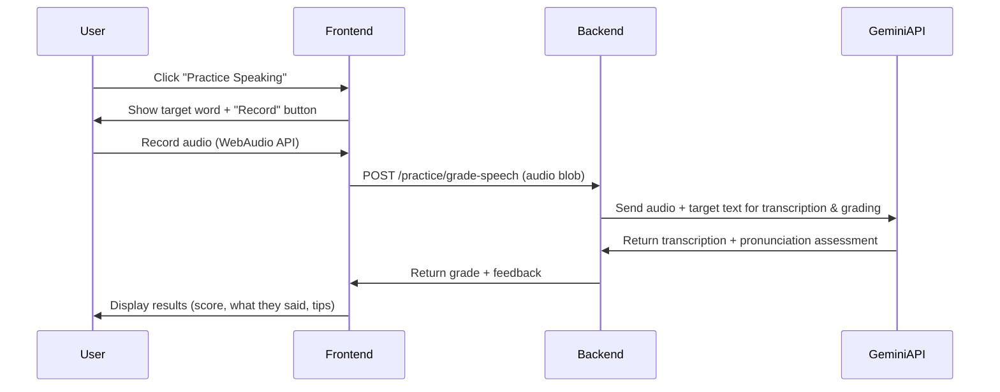

# Project Agent Instructions

## Project Overview
- **Name**: Finnish Language Learner
- **Description**: A web application that helps English users learn and practice their reading, writing, listening and speaking Finnish language skills.
- **Type**: Web App

---

## AI Coding Tools
- **IDE and LLMs**
  - Antigravity IDE with Gemini 3 Pro High AND Claude Opus 4.5 Thinking (switching LLMs depending on available capacity relative to rate limits)
- **MCP server**
  - Context7 documentation MCP server for LLM to retrieve the relevant documentation if it is unsure of a library's syntax

---

## Tech Stack
- **Language**: TypeScript (frontend), Python (backend)
- **Framework**: Next.js (frontend), FastAPI (backend)
- **Database**: SQLite
- **Styling**: Tailwind CSS
- **Package Manager**: npm
- Docker: yes
- **LLMs if needed**
  - For speech to text: Google SpeechRecognition API
    - During the implementation, we discovered that the "gemini-2.5-flash-native-audio-dialog live API" is not compatible with the browser's webm audio format. To fix this by converting PCM (Pulse Code Modulation) format to webm format, it might complicate our build, which is not the intention of this prototype. This prototype is intended to be a simple implementation of the required functionalities and technical components.
  - For normal text to text: gemma-3-27b
  - GOOGLE_API_KEY is in .env file - please do not share it with anyone else or commit it to GitHub


**Architecture Diagram**
- TO UPDATE



---


## Readings in Other Markdown Files
- agents.md
  - Coding standards, naming convention, formatting
  - Initial project structure
  - Do's and don'ts
  - Testing guidelines
  - Error handling
  - Git conventions
- assignment-instructions.md
  - Original assignment instructions
  - Problem description, expected output
  - Information about Finnish language proficiency levels 0 to A2.2
- curriculum.md
  - Curriculum for Finnish language proficiency levels 0 to A2.2 researched and grouped into topics by LLM


---

## Final Project Structure
```
project/
├── src/
│   ├── backend/          # FastAPI backend application
│   │   ├── routers/      # API route handlers
│   │   ├── services/     # Business logic
│   │   ├── tests/        # Backend tests
│   │   └── ...
│   ├── frontend/         # Next.js frontend application
│   │   ├── app/          # Next.js pages and layouts
│   │   ├── components/   # Reusable UI components
│   │   ├── __tests__/    # Frontend tests
│   │   └── ...
│   └── database/         # Database seeding and vocabulary data
│   │   ├── content/ # quiz content database (split by (1) proficiency levels, (2) topics, (3) sets of 10 questions per topic if there are more than 10 questions)
│   │   ├── vocabulary/ # vocabulary speech practice database
│   │   └── seed_data.json # initial seed data for the 'content' database ONLY (with the help of another Claude Opus LLM to research and generate "level0 - 01_alphabet questions", expanding from 2 questions to 75 questions)
├── Dockerfile            # Multi-stage Dockerfiles (frontend, backend, full frontend-backend)
├── docker-compose.yml    # Development Docker Compose (serve frontend, backend in 2 separate containers)
├── docker-compose.prod.yml    # Production Docker Compose (serve frontend AND backend in 1 container)
├── README.md             # Finnish Learner Website documentation
├── agents.md # Antigravity IDE agent instructions
├── assignment-instructions.md # Original assignment instructions
├── curriculum.md # Curriculum for Finnish language proficiency levels 0 to A2.2 researched and grouped into topics by LLM
└── ...
```


---

## Frontend (3 points)

The frontend is a modern, responsive web application built with Next.js 14 using the App Router architecture. It provides an interactive interface for users to learn Finnish through quizzes and speech practice.

### 1. Core Pages & Functionality
- **Registration (`/register`)**: 
    - Allows new users to create accounts with a username and password.
    - Interfaces with the `/auth/register` API.
    - Handles validation for existing usernames and registration errors.
- **Login (`/login`)**: 
    - Authenticates users via the OAuth2 compatible `/auth/login` endpoint (form-data).
    - Upon success, stores the JWT `access_token` in `localStorage` for session management.
    - Automatically redirects authenticated users to the `/dashboard`.
- **Dashboard (`/dashboard`)**: 
    - The personalized landing page for authenticated users.
    - Fetches the curriculum levels from the SQLite backend via `/levels`.
    - Features a user menu with "Sign Out" functionality to clear local storage and session.
- **Learning Path & Lessons**:
    - **Level Browser**: `LevelClient.tsx` (`src/frontend/app/learn/[levelId]/LevelClient.tsx`) displays lessons filtered by the selected proficiency level.
    - **Interactive Lessons**: `LessonClient.tsx` (`src/frontend/app/learn/[levelId]/[lessonId]/LessonClient.tsx`) is the core engine for the curriculum. It manages the quiz state, validates textual answers, and tracks user progress. **There can be more than 1 lesson/topic per level**

### 2. Interactive Speech Practice
- **Core Component**: `SpeechPractice.tsx` (`src/frontend/components/SpeechPractice.tsx`).
- **Functionality**:
    - Implements the browser's `SpeechRecognition` API for real-time user voice transcription.
    - **Grading**: Transcription is proxied to the FastAPI backend, which leverages LLMs (Google Gemma) to grade pronunciation for the target Finnish word.
    - **Visual Feedback**: Real-time score with color coding (green for correct, red for incorrect) and emojis to provide fast feedback.

### 3. Core Logic & Architecture
- **State Management**: Uses React Hooks (`useState`, `useEffect`, `useRef`) for local state and component-level logic.
- **API Communication**: 
    - Centralized Axios instance in `utils/api.ts`.
    - Automatically injects the JWT `Bearer` token from `localStorage` into the headers of all outgoing requests.

### 4. Execution Instructions
> [!IMPORTANT]
> All frontend commands must be executed from the `project/src/frontend` directory.

- **Development Mode**: `npm run dev` (Starts the dev server at `http://localhost:3000`)
- **Run Tests**: `npm run test` (Executes the Jest/React Testing Library suite)
- **Production Build**: `npm run build` (Generates an optimized production build)
- **Start Production Server**: `npm run start`

### 5. Complete Frontend Directory Map
- `src/frontend/`
    - `app/`: Next.js App Router root.
        - `layout.tsx`: Root layout with global styles and structure.
        - `page.tsx`: Landing page.
        - `dashboard/`: User progress and lesson selection.
        - `learn/[levelId]/`: Path-based routing for proficiency levels.
        - `learn/[levelId]/[lessonId]/`: Dynamic routes for specific lessons.
        - `login/` & `register/`: Authentication pages.
    - `components/`: Reusable UI components.
        - `SpeechPractice.tsx`: The primary interface for speaking exercises.
    - `utils/`: Helper utilities.
        - `api.ts`: Configured Axios instance with interceptors for API communication.
    - `__tests__/`: Unit and component tests ensuring front-end reliability.
    - `lib/`: Configuration for external libraries.
    - `globals.css`: Global Tailwind CSS styles.
    - **Configuration Files**: `package.json`, `tailwind.config.ts`, `tsconfig.json`, `jest.config.mjs`, `next.config.js`.
  

---

## API contract (OpenAPI specifications)

TODO ADD DOCUMENTATION: OpenAPI specification fully reflects front-end requirements and is used as the contract for backend development. (2 points)

---

## Backend
TODO ADD DOCUMENTATION: Back-end is well-structured, follows the OpenAPI specifications, and includes tests covering core functionality, clearly documented. (3 points)


---

## Database

TODO ADD DOCUMENTATION: Database layer is properly integrated, supports different environments (e.g. SQLite and Postgres), and is documented. (2 points)

> [!NOTE]
> * **Database Persistence**: The SQLite database (`finnish_app.db`) is stored in the `/data` directory inside the backend container. In `docker-compose.yml`, this is mapped to `./src/database` on your local machine.

### How to verify database location:
1. **On Local Machine**: Check if `project/src/database/finnish_app.db` exists after starting the containers.
  * Launch full container: `cd project`, then `docker compose up -d`
  * TO CHECK: `ls -lh project/src/database/finnish_app.db`
2. **Inside Container**: Run `docker exec -it finnish-backend ls -lh /data/finnish_app.db`.
  * TO CHECK: In the `project` folder, run `docker exec -it finnish-backend ls -lh /data/finnish_app.db`
3. **Check Persistence**: Any changes to `finnish_app.db` on your local machine are reflected inside the container (and vice versa) because they are linked by the Docker volume. Note that if you deploy the container to a production environment or a new container, the database will be lost.


---

## Containerization
TODO ADD DOCUMENTATION: The entire system runs via Docker or docker-compose with clear instructions. (2 points)


---

## Integration testing
TODO ADD DOCUMENTATION: Integration tests are clearly separated, cover key workflows (including database interactions), and are documented. (2 points)

---

## Deployment
TODO ADD DOCUMENTATION: Application is deployed to the cloud with a working URL or clear proof of deployment. (2 points)
WITH STEPS

---

## CI/CD pipeline
TODO ADD DOCUMENTATION: CI/CD pipeline runs tests and deploys the application when tests pass. (2 points)

---

## Reproducibility
TODO ADD DOCUMENTATION: Clear instructions exist to set up, run, test, and deploy the system end-to-end. (2 points)


---